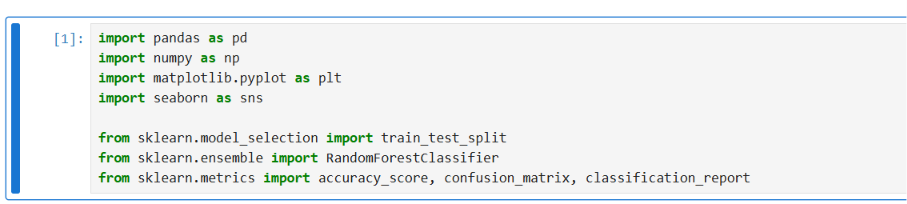
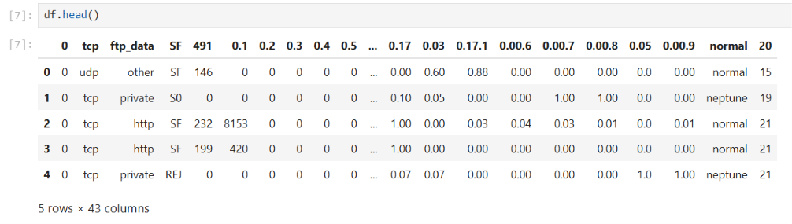
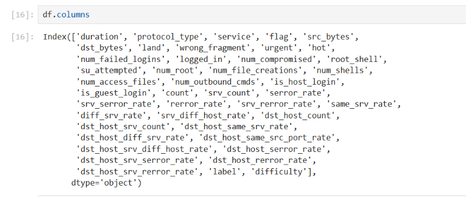
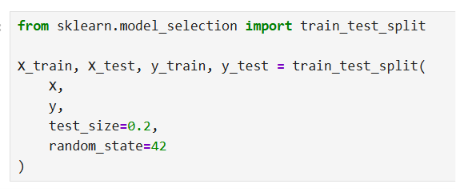
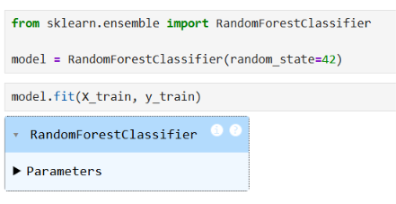
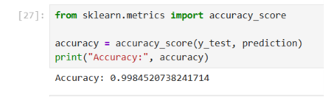
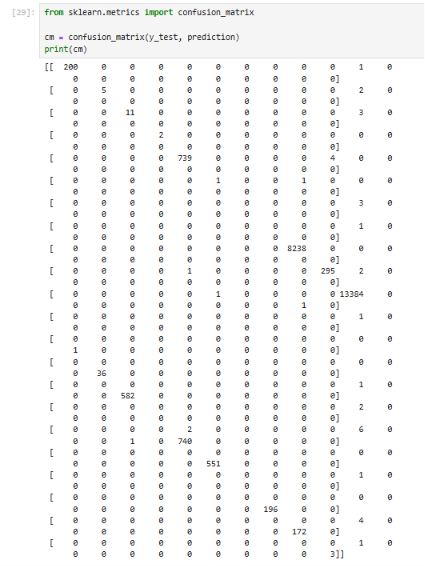
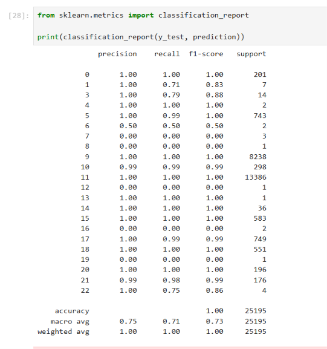
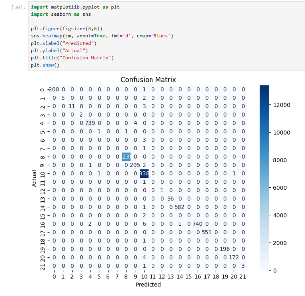

# AI-Based Intrusion Detection System

## 📌 Project Overview

This project uses Machine Learning to detect network intrusions using the NSL-KDD dataset. A Random Forest classifier is trained to classify network traffic as either normal or malicious.

---

## 🚀 Features

- Data Preprocessing
- Feature Engineering
- Random Forest Classification
- Intrusion Detection
- Model Evaluation
- Confusion Matrix
- Classification Report

---

## 🛠 Technologies Used

- Python
- Jupyter Notebook
- Pandas
- NumPy
- Scikit-learn
- Matplotlib

---

## 📂 Project Structure

AI_BASED_INTRUSION_DETECTION_SYSTEM_PROJECT/
│
├── Dataset/
├── Documentation/
├── Screenshots/
├── Source Code/
├── models/
├── README.md

---

## 📊 Dataset

NSL-KDD Dataset

---

## ▶️ Installation

```bash
pip install -r "Source Code/requirements.txt"
```

---

## ▶️ Run the Project

Open

```
Source Code/AI-Based_Intrusion_Detection_System.ipynb
```

and execute all cells.

---

## 📈 Results

- High Detection Accuracy
- Confusion Matrix
- Classification Report

---

## 👩‍💻 Author

**Kurangi Swathi Rechita**
## 📷 Screenshots

### Import Libraries


### Dataset Loading


### Dataset Preview


### Dataset Information


### Train-Test Split


### Model Training


### Model Prediction


### Accuracy Result


### Confusion Matrix


### Classification Report


### Final Result
